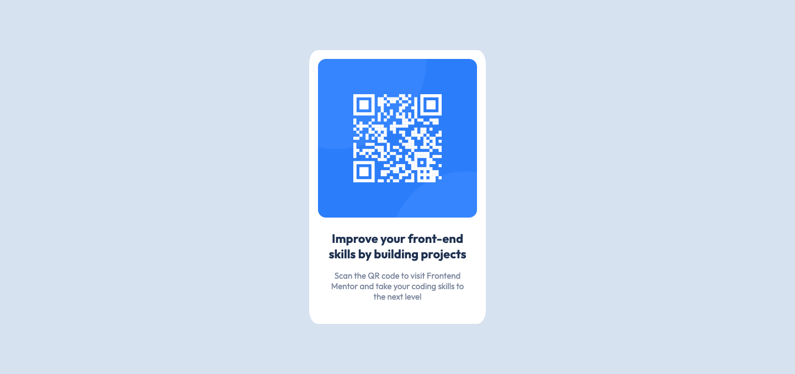

# Frontend Mentor - QR code component solution

This is a solution to the [QR code component challenge on Frontend Mentor](https://www.frontendmentor.io/challenges/qr-code-component-iux_sIO_H). Frontend Mentor challenges help you improve your coding skills by building realistic projects. 

## Table of contents

- [Overview](#overview)
  - [Screenshot](#screenshot)
  - [Links](#links)
- [My process](#my-process)
  - [Built with](#built-with)
  - [What I learned](#what-i-learned)
  - [Continued development](#continued-development)
  - [Useful resources](#useful-resources)
- [Author](#author)
- [Acknowledgments](#acknowledgments)

## Overview

### Screenshot

### Links

- Solution URL: [http://127.0.0.1:5500/design/qr_code.html](http://127.0.0.1:5500/design/qr_code.html)
<!--
- Live Site URL: [Add live site URL here](https://your-live-site-url.com)
-->

## My process

### Built with

- Semantic HTML5 markup
- CSS custom properties
- ~~Flexbox~~
- CSS Grid
<!--
- Mobile-first workflow
- [React](https://reactjs.org/) - JS library
- [Next.js](https://nextjs.org/) - React framework
- [Styled Components](https://styled-components.com/) - For styles
-->

### What I learned

- How to take a screenshot of the page on Chrome
  > `cmd + opt + I` > `cmd + shift + P` > `Screenshot`

- File paths.
  > `./`      current directory
  >
  > `../`     one level up directory
  >
  > `../../`  two levels up directory
  
- Strikethrough text on .md
  > Surround the text with two tildes (~)

### Continued development

- Concepts I'm still not completely comfortable with:
  - CSS grid
  - Github repo
  - The HTML attributes `name=""` and `content=""`
  - How to tab on .md
  - How to comment on .md
  - How to show hidden folders on VS Code

- Techniques I want to refine and perfect:
  - The CSS property `margin`

### Useful resources

- [W3Schools HTML Tutorial](https://www.w3schools.com/html/default.asp) - This helped me throughout my solution.

- [Markdown Guide](https://www.markdownguide.org/basic-syntax/) - This helped me at writing my first text in .md.

- [Git Guide](https://www.youtube.com/watch?v=SWYqp7iY_Tc) - This helped me at understanding the basics of git. The best git tutorial that i could find.

- [Change Directories on Mac Terminal](https://www.easeus.com/computer-instruction/change-directory-in-terminal-mac.html#:~:text=To%20change%20the%20directory%20in%20Terminal%20Mac%2C%20it%27s%20recommended%20to,desktop%20into%20the%20Terminal%20Mac.) - This helped me at learning basic stuff about navigating through Mac Terminal.

- [Showing Hidden Folders on Finder](https://www.pcmag.com/how-to/how-to-access-your-macs-hidden-files#:~:text=View%20Hidden%20Files%20in%20Finder&text=In%20Finder%2C%20click%20your%20hard,make%20the%20hidden%20files%20appear.) - This taught me an easy keyboard shortcut to unhide hidden folders on Finder.

<!--
- [Example resource 1](https://www.markdownguide.org/basic-syntax/) - This helped me for XYZ reason. I really liked this pattern and will use it going forward.
- [Example resource 2](https://www.example.com) - This is an amazing article which helped me finally understand XYZ. I'd recommend it to anyone still learning this concept.
-->

## Author

<!--
- Website - [Andrey Alves](https://www.your-site.com)
-->
- Frontend Mentor - [@expertiner](https://www.frontendmentor.io/profile/Expertiner)
<!--
- Twitter - [@yourusername](https://www.twitter.com/yourusername)
-->

## Acknowledgments

Got some inspiration from the Frontend Mentor Discord's Server.

<!--
This is where you can give a hat tip to anyone who helped you out on this project. Perhaps you worked in a team or got some inspiration from someone else's solution. This is the perfect place to give them some credit.

**Note: Delete this note and edit this section's content as necessary. If you completed this challenge by yourself, feel free to delete this section entirely.**
-->